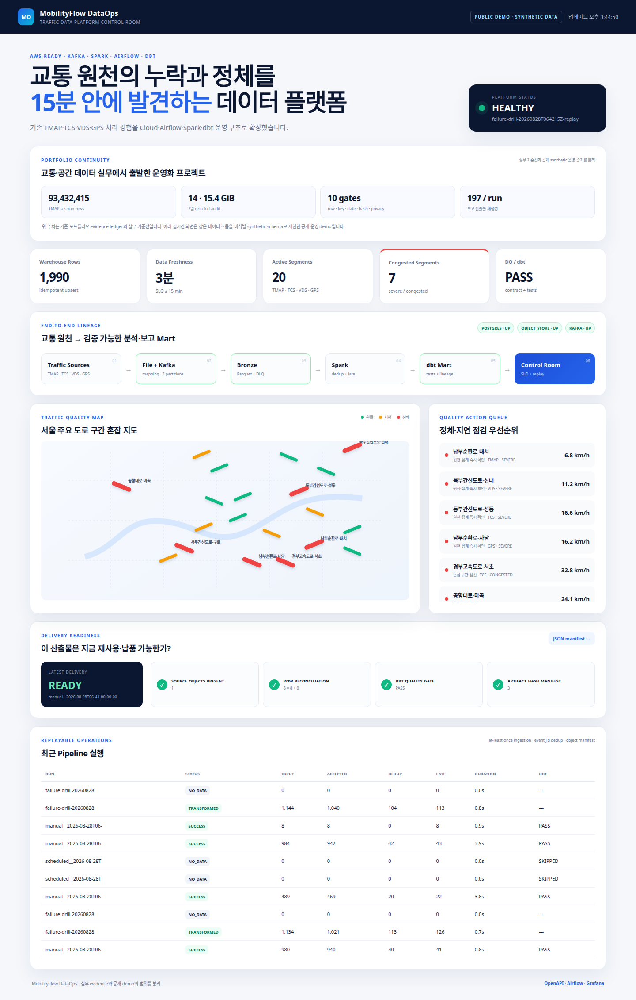

# MobilityFlow DataOps

> **TMAP·TCS·VDS·GPS 원천을 실제로 검수·적재하고, 산출물의 납품 가능 여부를 한 화면에서 판단하는 교통 데이터 운영 플랫폼**

기존 포트폴리오의 `93,432,415행 TMAP audit`, `row·sum·hash gate`, `197 artifact/run` 경험을
Cloud·Airflow·Spark·dbt 운영 구조로 확장했습니다. 연구용 모델이 아니라 현업에서 반복되는
**파일 사전검수 → 격리 → 적재 → 품질차단 → 납품 manifest**를 줄이는 도구입니다.

CSV·CSV.GZ·Parquet file은 column mapping을 적용해 바로 검수할 수 있고, 15분 feed는
Kafka-compatible stream으로 받을 수 있습니다. 공개 저장소에서는 고객 원천 대신 같은 contract의
privacy-safe synthetic fixture를 사용합니다.




## 30초 요약

| 질문 | 구현 증거 |
|---|---|
| 실제 업무 파일을 받을 수 있는가? | CSV·CSV.GZ·Parquet + source별 column mapping + `--dry-run` 사전검수 |
| 15분 feed는 어떻게 받는가? | idempotent producer/connector → Redpanda(Kafka API) 3 partitions |
| 잘못된 데이터는 어떻게 다루는가? | 오류 사유별 quarantine/DLQ 격리, source hash·offset 보존 |
| 장애 후 유실되지 않는가? | Parquet upload 후 offset commit, stable consumer group, `event_id` dedup |
| 재실행해도 안전한가? | bronze object manifest + PostgreSQL upsert + dbt incremental unique key |
| 누가 언제 실패를 아는가? | Airflow retry/timeout, Prometheus metrics, Grafana, freshness/DQ status |
| Cloud로 옮길 수 있는가? | S3-compatible adapter와 Terraform 기반 AWS S3/ECR/ECS/CloudWatch baseline |
| 산출물을 바로 써도 되는가? | row reconciliation + dbt gate + SHA-256 artifact manifest가 모두 PASS일 때만 `READY` |

## End-to-end data flow

```text
Daily files: CSV / CSV.GZ / Parquet → mapping + dry-run + quarantine ─┐
15m feeds: TMAP / TCS / VDS / GPS → Redpanda + DLQ ────────────────┤
                                                                    ▼
MinIO locally / AWS S3 in cloud (partitioned Bronze Parquet)
  → Airflow every 15 min (retry, timeout, no overlapping run)
  → Spark (dedup, late-event flag, congestion classification)
  → PostgreSQL + dbt (staging, incremental fact, marts, tests, freshness)
  → Delivery READY/BLOCKED manifest + FastAPI Control Room + Prometheus/Grafana
```

### Data contract

Event grain은 `segment_id × observed_at`이며 transport-level idempotency key는 `event_id`입니다.
속도·기준속도·교통량·통행시간·좌표·timezone을 ingestion boundary에서 검증합니다. Kafka의
at-least-once 특성상 발생 가능한 중복은 Spark와 warehouse 두 계층에서 제거합니다.

## Quick start

Requirements: Docker 24+, Docker Compose v2+, 약 8 GB memory.

```bash
cp .env.example .env
make demo
```

### 실제 파일 사전검수·적재

먼저 sample을 object store에 올리지 않고 검사합니다.

```bash
uv run mobility-ingest-file examples/tcs_15min_sample.csv \
  --source-system TCS \
  --column-map @examples/tcs_column_map.json \
  --dry-run
```

`input_rows = accepted_rows + rejected_rows`를 확인한 뒤 `--dry-run`을 제거하면 valid row는
Bronze Parquet, invalid row는 오류 사유가 포함된 quarantine Parquet로 분리됩니다. 동일 파일과
mapping은 SHA-256 fingerprint가 같아 재업로드·재실행을 추적할 수 있습니다.

```bash
uv run mobility-ingest-file /path/to/tmap_daily.csv.gz \
  --source-system TMAP \
  --vehicle-type PASSENGER \
  --column-map @/path/to/tmap_column_map.json \
  --output ingest_report.json
```

`make demo`는 다음을 한 번에 실행합니다.

1. PostgreSQL, Redpanda, MinIO, Spark runner, API, Prometheus, Grafana 기동
2. fault가 포함된 synthetic event 생성
3. Kafka → Bronze Parquet 적재 확인
4. Airflow DAG로 Spark transform → dbt build/test/freshness 실행
5. 측정된 run evidence를 `docs/evidence/generated/run_evidence.json`에 저장

| UI | URL | 확인할 내용 |
|---|---|---|
| Control Room | http://localhost:18000 | freshness, 정체 구간, 품질 gate, 납품 READY/BLOCKED |
| Airflow | http://localhost:18080 | DAG retry, log, task dependency |
| Grafana | http://localhost:13000 | throughput, DLQ, duration, SLO |
| MinIO | http://localhost:19001 | bronze/silver partition과 Parquet object |
| Spark UI | http://localhost:14040 | 실행 중 stage와 shuffle |

Local UI credential은 `.env.example`의 demo-only 값입니다. 공유 또는 Cloud 환경에서는 반드시
교체해야 합니다.

## Operations built into the project

- **Retry / replay:** Airflow task retry 2회, object manifest에 없는 batch만 처리
- **DLQ:** schema/JSON 위반 event를 source topic/partition/offset과 함께 격리
- **Batch preflight:** source column mapping, timezone·범위 검증, dry-run, 오류 사유별 quarantine
- **Late data:** event time과 ingestion time 차이가 15분을 넘으면 `is_late=true`
- **Idempotency:** upload 완료 전 Kafka offset을 commit하지 않고 `event_id`로 재처리 안전성 확보
- **Quality gate:** dbt `unique`, `not_null`, `relationships`, `accepted_values`, custom SQL tests
- **Freshness SLO:** warning 15분, failure 30분
- **Delivery gate:** input/accepted/dedup reconciliation, dbt PASS, Silver SHA-256 manifest가 모두
  통과해야 `READY`
- **Observability:** Prometheus metrics, provisioned Grafana dashboard, run-level evidence JSON
- **Backfill:** 동일 DAG를 기간 지정 실행하며 이미 처리된 object는 manifest로 skip 가능

Failure drill과 backfill 절차는 [운영 Runbook](docs/runbook.md)에 있습니다.

## AWS mode

Local MinIO와 AWS S3는 같은 adapter를 사용합니다. `S3_ENDPOINT_URL`을 비우고 Terraform output의
bucket을 설정하면 application code 변경 없이 AWS credential chain을 사용합니다.

```bash
cd infra/terraform
terraform init
terraform plan -var='alert_email=you@example.com'
```

Terraform은 encrypted/versioned S3 data lake, immutable ECR repositories, ECS cluster,
CloudWatch dashboard·alarm, least-privilege task role을 선언합니다. 실제 `terraform apply`는 비용과
external state를 만들기 때문에 명시적으로 실행하지 않습니다. 상세 내용은
[AWS deployment guide](docs/aws-deployment.md)를 참고하세요.

## Verification

```bash
make check          # ruff + pytest + terraform validate + compose config
make failure-drill  # buffered outage, DLQ, idempotent no-op replay evidence
```

실무 기준선(93,432,415행·15.399GiB·197 artifact/run)은 기존 portfolio evidence ledger와 연결하고,
공개 운영 demo의 처리량·시간·중복 제거 건수는 각 실행의 evidence JSON으로 분리합니다.

검증된 example result와 이력서용 표현은 [Evidence guide](docs/evidence/README.md)와
[Portfolio entry](docs/portfolio-entry.md)에 분리해 두었습니다.

## Repository map

```text
airflow/dags/             orchestration, retry, quality gate
dbt/                      staging/fact/marts/tests/exposure
infra/terraform/          AWS S3/ECR/ECS/CloudWatch baseline
monitoring/               Prometheus and provisioned Grafana dashboard
src/mobility_flow/        file ingestion, stream writer, Spark runner, Control API
examples/                 실제 file mapping 사용 예시
tests/                     contracts and deterministic failure fixtures
docs/evidence/generated/  run-scoped metrics and screenshots (generated)
```

## Scope and honesty

- 공개 demo의 교통 관측값과 도로 구간은 **synthetic data**이며 실시간 서울시 API 결과가 아닙니다.
- 실제 업무 파일은 `mobility-ingest-file`로 사용할 수 있지만 source별 의미·집계 단위는 mapping 전에
  담당자가 확인해야 합니다.
- Local stack은 managed Cloud service 운영 경력을 대신하지 않습니다. 대신 동일 artifact가 AWS S3로
  이동하고 CloudWatch에 지표를 발행할 수 있는 boundary와 IaC를 제공합니다.
- Spark 기본 mode는 laptop에서 재현 가능한 `local[2]`입니다. `SPARK_MASTER`로 standalone cluster를
  연결할 수 있지만, 분산 cluster benchmark를 주장하지 않습니다.

License: MIT
