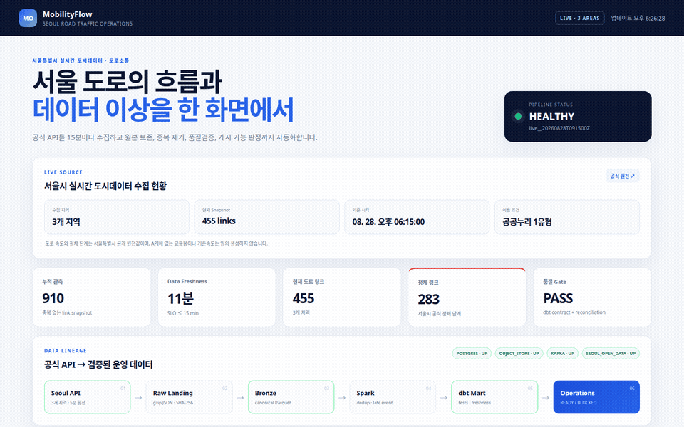
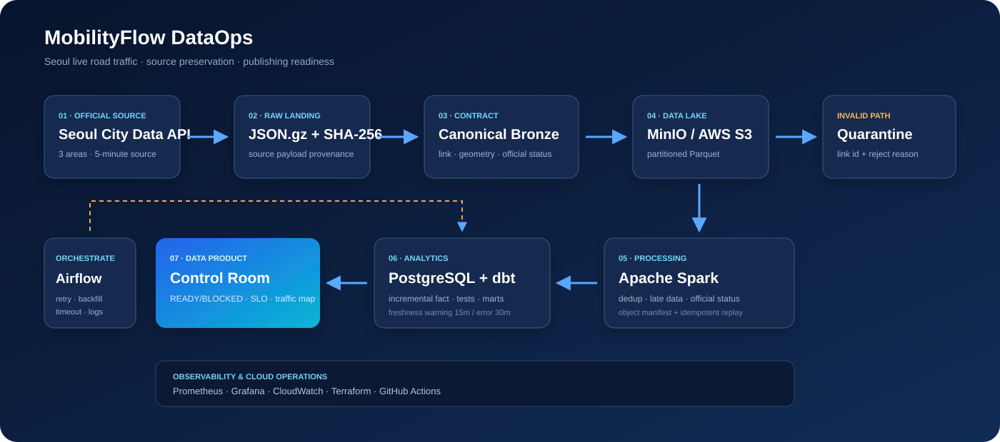

# MobilityFlow

서울특별시의 실시간 도로소통 데이터를 주기적으로 수집하고, 원본 보존부터 품질검증과 게시 가능
판정까지 수행하는 데이터 파이프라인입니다. Airflow가 수집·재실행을 조정하고 PostgreSQL/dbt가
모델과 품질 기준을 관리합니다.



> 실제 실행 전체 영상: [MP4 보기](docs/mobilityflow-live.mp4)

## 실제로 하는 일

- 서울 열린데이터광장 API에서 `광화문·덕수궁`, `강남 MICE 관광특구`, `여의도`의 도로 링크를
  15분마다 수집합니다.
- 수신한 원문을 gzip JSON으로 먼저 보존하고 SHA-256을 남깁니다.
- API의 `LINK_ID`, 속도, 도로명, 거리, 좌표열, 공식 정체 단계를 canonical Parquet로 변환합니다.
- PySpark `local[2]` 변환 단계가 새 Bronze object만 읽어 `event_id` 중복을 제거하고 PostgreSQL에
  멱등 적재합니다. 이 단계는 분산 성능 주장이 아니라 변환·재실행 계약을 검증하는 범위입니다.
- dbt가 서울 원천 전용 freshness를 포함한 28개 data test와 source freshness를 통과한 경우에만 최신 mart를 공개합니다.
- row reconciliation과 Silver artifact hash까지 모두 통과해야 Control Room이 `READY`를 표시합니다.

API에 존재하지 않는 교통량이나 기준속도는 임의로 채우지 않습니다. 해당 필드는 `NULL`로 보존하고
정체 상태는 서울시가 제공한 `원활·서행·정체` 값을 그대로 표준화합니다.

## 현재 저장된 실제 데이터

[공개 Snapshot](data/reference/seoul_traffic_latest.parquet)은 서울시 API에서 직접 수집한 데이터입니다.

| 항목 | 값 |
|---|---:|
| 수집 시각 | 2026-08-28 18:22 KST |
| 지역 | 3개 |
| 도로 링크 | 455개 |
| 검증 통과 | 455개 |
| 격리 | 0개 |

원천별 payload hash와 수집 조건은 [수집 Manifest](data/reference/source_manifest.json)에서 확인할 수 있습니다.

### Scheduled operation snapshot · 2026-08-31

local Docker Compose에서 Airflow 15분 schedule을 유지한 시점의 운영 Snapshot입니다.

| 항목 | 확인값 |
|---|---:|
| Warehouse 누적 관측 | 115,570행 |
| 최신 run | 455 input = 455 accepted + 0 duplicate |
| 최근 실행 | 10/10 SUCCESS, dbt PASS 10/10 |
| 게시 판정 | READY, gate 4/4 PASS |

계측 근거는 [scheduled operation evidence](docs/evidence/scheduled_operation_20260831.json)와
[Control Room](docs/control-room.png)에 남겼습니다. 이 수치는 local scheduled operation이며 managed
Airflow나 분산 Spark 운영 성과로 확대하지 않습니다.

### AWS hybrid deployment · 2026-08-31

기존 AWS credential chain을 사용해 `ap-northeast-2`에 S3 data lake, ECR 4개 repository, ECS cluster,
CloudWatch dashboard·alarm·log group과 IAM role을 Terraform으로 배포했습니다. 같은 시점의 실제 서울
API 455행을 AWS S3의 raw 3개·Bronze 3개 object로 적재하고 local pipeline의 측정 metric 4개를
CloudWatch에 게시했습니다.

| 항목 | 확인값 |
|---|---:|
| Terraform apply | 25 added · 0 changed · 0 destroyed |
| S3 | 13 objects · versioning · AES-256 · public block 4/4 |
| ECR | 4 repositories · native scan 4/4 OS finding 0 · deployed app Trivy C/H 0 |
| CloudWatch | 5 metrics · freshness/DQ alarm `OK` |
| ECS | Fargate one-shot runtime check · exit code 0 |

초기 Debian base image의 finding으로 runtime 승격을 차단한 뒤, 배포 application image를 digest-pinned
Wolfi base로 교체했습니다. ECR native scan 4/4에서 OS package finding 0건, 배포 app의 Trivy
critical/high 0건을 확인했고, Fargate task가 ECR image pull → S3 object byte-read → CloudWatch metric publish를
exit code 0으로 완료했습니다. Airflow·PostgreSQL/dbt·PySpark 실행은 계속 local Docker 범위이며,
always-on ECS service 운영으로 확대하지 않습니다. 계정·bucket·ARN을 제거한 결과는
[AWS deployment evidence](docs/evidence/aws_deployment_20260831.json)에 남겼습니다.

데이터 제공처는 [서울시 실시간 도시데이터](https://data.seoul.go.kr/SeoulRtd/)이며,
[서울 열린데이터광장 데이터셋](https://data.seoul.go.kr/dataList/OA-21285/A/1/datasetView.do)의
이용정책과 출처표시 조건을 따릅니다. 서울시는 도로소통 데이터의 갱신주기를 5분으로 안내합니다.

## 처리 흐름



```text
Seoul Real-Time City Data API
  → Raw Landing JSON.gz + SHA-256
  → Canonical Bronze Parquet
  → Airflow 15-minute schedule
  → PySpark local[2] dedup / late-event handling
  → PostgreSQL + dbt marts / 28 tests / source freshness
  → READY or BLOCKED manifest
  → Control Room + Prometheus + Grafana
```

각 source response와 Bronze/Silver artifact는 run 단위로 추적할 수 있습니다. 같은 5분 Snapshot을
다시 받아도 `area_code + LINK_ID + snapshot_at` 기반 `event_id`가 같아 중복 적재되지 않습니다.

## 기술 선택과 실행 범위

| 구성 | 이 프로젝트에서 맡는 역할 | 검증 범위 |
|---|---|---|
| Airflow | 15분 schedule, retry, manual run, backfill | local Docker와 GitHub Actions |
| PySpark `local[2]` | Bronze 변환, dedup, late-event 분리 | 변환 정확성과 idempotent replay |
| PostgreSQL + dbt | Silver mart, relationship·freshness test | 실제 서울 API Snapshot과 CI |
| Prometheus + Grafana | run 상태, 실패, freshness 관측 | local Docker dashboard |
| AWS | S3 lake, ECR, ECS Fargate, CloudWatch, IAM | 실제 S3 read·metric publish one-shot task exit 0 |

PySpark를 처리량 성과로 제시하지 않습니다. 현재 공개 Snapshot은 3개 지역·455개 도로 링크이며,
이 프로젝트의 주된 검증 대상은 scheduling, source preservation, data contract, quality gate입니다.

## 실행

Requirements: Docker 24+, Docker Compose v2+, 약 8 GB memory, 서울 열린데이터광장 인증키.

```bash
cp .env.example .env
# .env의 SEOUL_OPEN_DATA_API_KEY에 무료 발급 키 입력
make live
```

`make live`는 전체 서비스를 기동하고 실제 API 수집 → PySpark local 변환 → dbt → 게시 Gate까지 Airflow DAG로
실행합니다.

| 화면 | URL | 용도 |
|---|---|---|
| Control Room | http://localhost:18000 | 실제 도로 링크, 정체, freshness, 게시 Gate |
| Airflow | http://localhost:18080 | 수집·변환·품질검증 task와 retry 이력 |
| Grafana | http://localhost:13000 | 처리량, 실패, 실행시간, freshness |
| MinIO | http://localhost:19001 | Raw/Bronze/Silver object와 partition |
| Spark UI | http://localhost:14040 | 실행 중 stage와 task |

현재 설정으로 한 번만 다시 수집하려면 다음을 실행합니다.

```bash
make sync
```

실제 Control Room을 같은 방식으로 다시 녹화하려면 서비스 실행 후 `make capture`를 실행합니다.

## 운영 안전장치

- **Source preservation:** 필요한 도로소통 응답을 변환 전에 gzip JSON으로 보존
- **Idempotency:** 5분 Snapshot 단위 deterministic `event_id`, object manifest, PostgreSQL upsert
- **Quarantine:** 좌표·속도·거리·schema 오류를 원천 링크와 사유가 포함된 object로 격리
- **Quality gate:** `unique`, `not_null`, `relationships`, `accepted_values`, reconciliation SQL
- **Freshness:** warning 15분, failure 30분
- **Publishing gate:** source object, row reconciliation, dbt PASS, artifact SHA-256가 모두 필요
- **Recovery:** Airflow retry/timeout, 새 object만 처리, 동일 run replay 안전성
- **Observability:** Prometheus target과 provisioned Grafana dashboard

운영 대응과 replay 절차는 [Operations runbook](docs/runbook.md), field 정의와 원천 매핑은
[Data contract](docs/data-contract.md)에 있습니다.

## Cloud 배포 경계

Local MinIO와 AWS S3는 같은 storage adapter를 사용합니다. Terraform은 versioning/encryption이
적용된 S3, ECR, ECS, CloudWatch dashboard·alarm, SNS와 least-privilege IAM을 선언하며 2026-08-31
`dev` baseline에 실제 적용했습니다.

```bash
cd infra/terraform
terraform init
terraform plan -var='alert_email=you@example.com'
```

실제 AWS `apply`는 비용과 외부 상태를 만들기 때문에 자동 실행하지 않습니다. 자세한 내용은
[AWS deployment guide](docs/aws-deployment.md)에 있습니다.

## 검증

```bash
make check
make failure-drill
```

- Unit/contract test 27건
- dbt data test 28건(서울 원천 전용 freshness 포함) + source freshness
- Terraform fmt/init/validate
- Docker Compose validation
- GitHub Actions quality gate

2026-08-28 장애복구 drill에서는 Bronze writer 중단 중 1,200개 event를 보존하고 재기동 후 17초에
backlog를 회수했습니다. 첫 변환에서 104개 중복을 제거했으며 즉시 replay 입력은 0건이었습니다.
이는 서울 API 처리량이 아니라 transport recovery 검증값입니다. 상세 수치는
[runtime evidence](docs/evidence/README.md)와
[drill 결과](docs/evidence/failure_drill_20260828.json)에 있습니다.

## 데이터 사용 범위

- 저장된 도로 데이터는 서울특별시가 공개한 집계형 도로소통 정보이며 회사 내부 원천을 포함하지 않습니다.
- `observed_at`은 API에 별도 측정시각이 없어 수집시각을 5분 단위로 내린 Snapshot 기준시각입니다.
- Terraform apply로 생성한 AWS baseline은 account ID·bucket·ARN을 공개하지 않습니다. Fargate는
  배포 전 runtime check만 one-shot으로 실행하며 상시 service·SLA를 주장하지 않습니다.

License: MIT. 외부 데이터에는 원 제공기관의 이용조건이 우선 적용됩니다.

변경 이력은 [CHANGELOG](CHANGELOG.md)에 기록합니다.
